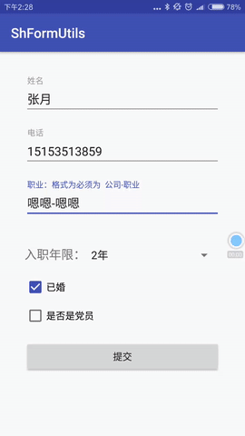

# ShFormUtils
android表单映射框架
#Download

Download the latest JAR or grab via Maven:
~~~xml
<dependency>
  <groupId>com.sh.zsh.code</groupId>
  <artifactId>shform</artifactId>
  <version>2.0.8</version>
  <type>pom</type>
</dependency>
~~~
or Gradle:
~~~gradle
compile 'com.sh.zsh.code:shform:2.0.8'
~~~
#功能
* 表单对象映射

   * 1.页面实现 FormCheckInterface 接口
   * 2.开启表单注入 FormInit.injection(this);
   ~~~java
         @Override
           protected void onCreate(Bundle savedInstanceState) {
               super.onCreate(savedInstanceState);
               setContentView(R.layout.activity_main);
               nameEdit = (EditText) findViewById(R.id.name);
               phoneEdit = (EditText) findViewById(R.id.phone);
               professionEdit = (EditText) findViewById(R.id.profession);
               spinner = (Spinner) findViewById(R.id.spinner);
               married = (CheckBox) findViewById(R.id.married);
               party = (CheckBox) findViewById(R.id.party);
               /**
                * 初始化表单注入  要在 所有控件初始化成功后 调用
                */
               FormInit.injection(this);
           }
   ~~~
   * 3.在 onDestroy 里 注销 表单
  ~~~java
           @Override
           protected void onDestroy() {
           /**
            * 注销表单
            */
           FormInit.deleteInjection(this);
           super.onDestroy();
           }
  ~~~
   * 4.通过 @FormInjection 绑定控件
  ~~~java
       /**
        * name 对应 实体类 字段名
        * message 参数为空的时候 默认提示 的字符串
        * isNull  该字段是否可以为空  默认 false
        */
         @FormInjection(name = "name", message = "名字",isNull = true)
         EditText nameEdit;
         @FormCheck(type = CheckType.Phone)
         @FormInjection(name = "phone", message = "电话")
         EditText phoneEdit;
         @FormInjection(name = "profession", message = "公司-职业")
         EditText professionEdit;
         @FormInjection(name = "workingLife", message = "工作时间")
         Spinner spinner;
         @FormInjection(name = "married")
         CheckBox married;
   ~~~
   * 4.调用映射方法
   ~~~java
        /**
          * 表单自动生成对象
          */
         UserModel userModel = FormUtls.formToObjectAndCheck(this,UserModel.class);
        /**
          * 实体对象 映射到表单 返回true 表示映射成功
          */
         FormUtls.objectToForm(this,userModel);
  ~~~

*  表单参数检查
    * 1.使用 @FormCheck 实现表单验证
~~~java
   //type 是 验证类型枚举   默认 是自定义验证
    @FormCheck(type = CheckType.Phone)
    @FormInjection(name = "phone", message = "电话")
    EditText phoneEdit;
    @FormCheck
    @FormInjection(name = "profession", message = "公司-职业")
    EditText professionEdit;

        /**
         * 通过 实现 FormCheckInterface 接口的 formCheck
         * 自定定义 表单检查 默认要返回true
         * @param v
         * @return
         */
        @Override
        public boolean formCheck(View v) {
            switch (v.getId()){
                case R.id.profession:
                    if(!(professionEdit.getText()+"").contains("-")){
                        Toast.makeText(this,"职业格式不正确",Toast.LENGTH_SHORT).show();
                        return false;
                    }
                    break;
            }
            return true;
        }

        /**
         * 表单检查 为空回调
         * @param v
         * @param message
         */
        @Override
        public void formCheckParamCall(View v, String message) {
            Toast.makeText(this,message,Toast.LENGTH_SHORT).show();
        }
        /**
         * 表单检查 不合法回调
         * @param v
         * @param message
         */
        @Override
        public void formCheckNullCall(View v, String message) {
            Toast.makeText(this,message,Toast.LENGTH_SHORT).show();
        }
~~~

