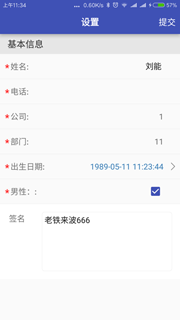
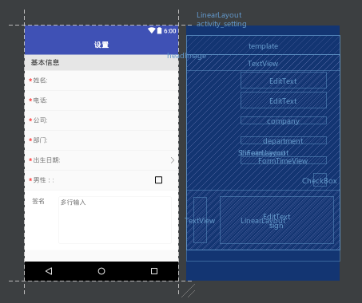

# ShFormUtils
android表单映射框架 SHFormLayout 快速生成表单布局
# Download

Download the latest JAR or grab via Maven:
~~~xml
<dependency>
  <groupId>com.sh.zsh.code</groupId>
  <artifactId>shform</artifactId>
  <version>3.2.2</version>
  <type>pom</type>
</dependency>
~~~
or Gradle:
~~~gradle
compile 'com.sh.zsh.code:shform:3.2.2'
~~~
# 功能
## 表单对象映射

   * 1.页面实现 FormCheckInterface 接口   改接口 是页面表单检查的回调 下面有介绍
   * 2.开启表单注入 FormInit.injection(this);
   ~~~java
         @Override
           protected void onCreate(Bundle savedInstanceState) {
               super.onCreate(savedInstanceState);
               setContentView(R.layout.activity_main);
               nameEdit = (EditText) findViewById(R.id.name);
               phoneEdit = (EditText) findViewById(R.id.phone);
               professionEdit = (EditText) findViewById(R.id.profession);
               spinner = (Spinner) findViewById(R.id.spinner);
               married = (CheckBox) findViewById(R.id.married);
               party = (CheckBox) findViewById(R.id.party);
               /**
                * 初始化表单注入  要在 所有控件初始化成功后 调用
                */
               FormInit.injection(this);
           }
   ~~~
   * 3.在 onDestroy 里 注销 表单
  ~~~java
           @Override
           protected void onDestroy() {
           /**
            * 注销表单
            */
           FormInit.deleteInjection(this);
           super.onDestroy();
           }
  ~~~
   * 4.通过 @FormInjection 绑定控件
  ~~~java
       /**
        * name 对应 实体类 字段名
        * message 参数为空的时候 默认提示 的字符串
        * isNull  该字段是否可以为空  默认 false
        */
         @FormInjection(name = "name", message = "名字",isNull = true)
         EditText nameEdit;
         @FormCheck(type = CheckType.Phone)
         @FormInjection(name = "phone", message = "电话")
         EditText phoneEdit;
         @FormInjection(name = "profession", message = "公司-职业")
         EditText professionEdit;
         @FormInjection(name = "workingLife", message = "工作时间")
         Spinner spinner;
         @FormInjection(name = "married")
         CheckBox married;
   ~~~
   * 4.调用映射方法
   ~~~java
        /**
          * 表单自动生成对象
          */
         UserModel userModel = FormUtls.formToObjectAndCheck(this,UserModel.class);
        /**
          * 实体对象 映射到表单 返回true 表示映射成功
          */
         FormUtls.objectToForm(this,userModel);
  ~~~

##  表单参数检查

    * 1.使用 @FormCheck

~~~java
   //type 是 验证类型枚举   默认 是自定义验证
    @FormCheck(type = CheckType.Phone)
    @FormInjection(name = "phone", message = "电话")
    EditText phoneEdit;
    @FormCheck
    @FormInjection(name = "profession", message = "公司-职业")
    EditText professionEdit;

        /**
         * 通过 实现 FormCheckInterface 接口的 formCheck
         * 自定定义 表单检查 默认要返回true
         * @param v
         * @return
         */
        @Override
        public boolean formCheck(View v) {
            switch (v.getId()){
                case R.id.profession:
                    if(!(professionEdit.getText()+"").contains("-")){
                        Toast.makeText(this,"职业格式不正确",Toast.LENGTH_SHORT).show();
                        return false;
                    }
                    break;
            }
            return true;
        }

        /**
         * 表单检查 不合法回调
         * @param v
         * @param message
         */
        @Override
        public void formCheckNullCall(View v, String message) {
            Toast.makeText(this,message,Toast.LENGTH_SHORT).show();
        }
~~~
#### 验证类型
    CUSTOM,//自定义
    PHONE,//手机号
    EMAIL,//邮箱
    CHINESE,//中文
    IDCARD,//身份证
    ISDATA,//“yyyy-mm-dd“ 格式的日期校验，已考虑平闰年
    AMOUNT_MONEY,//金额校验，精确到2位小数
    AMOUNT,//存数字
    URL,//Url
    PASSWORD;//密码强度 是不是6至12位字母组合

##  快速生成表单布局 ShFormLayout

ShFormLayout 可以在使用 系统控件的基础上 实现快速生成表单布局 样式

~~~xml

   <com.sh.zsh.code.layout.ShFormLayout
     <!--该布局 需要在这确定 每行的高度 -->
                 app:less_form_row_height="50dp"
                android:layout_width="match_parent"
                android:layout_height="wrap_content">
                <TextView
                    <!--这里表明 这个控件 只是用于显示标题-->
                    app:less_form_group_titel="true"
                    android:text="基本信息"
                    android:layout_width="match_parent"
                    android:layout_height="wrap_content" />
                <EditText
                    <!--该行的标题-->
                    app:less_form_title="姓名"
                    <!--该行对应的字段名-->
                    app:less_form_name="name"
                    <!--该行是否必填-->
                    app:less_form_must="true"
                     android:layout_height="wrap_content"
                     android:layout_width="match_parent"
                   />

                <EditText
                    app:less_form_title="电话"
                    <!--该行的验证方式-->
                    app:less_form_check_type="phone"
                    app:less_form_name="phone"
                    android:layout_height="wrap_content"
                    android:layout_width="match_parent"
                    app:less_form_must="true"
                    />
                <com.sh.zsh.code.layout.view.FormSpinner
                    android:id="@+id/company"
                    app:less_form_title="公司"
                    app:less_form_name="company"
                    android:layout_height="wrap_content"
                    android:layout_width="match_parent"
                    app:less_form_must="true" />
                <com.sh.zsh.code.layout.view.FormSpinner
                    android:id="@+id/department"
                    app:less_form_title="部门"
                    app:less_form_name="department"
                    android:layout_height="wrap_content"
                    android:layout_width="match_parent"
                    app:less_form_must="true" />

                <com.sh.zsh.code.layout.view.FormTimeView
                    app:less_form_title="出生日期"
                    app:less_form_name="birthday"
                    android:layout_height="wrap_content"
                    android:layout_width="match_parent"
                    app:less_form_must="true" />

                <CheckBox
                    app:less_form_title="男性："
                    app:less_form_name="sex"
                    android:layout_height="wrap_content"
                    android:layout_width="match_parent"
                    app:less_form_must="true" />

                <LinearLayout
                    app:less_form_group_top_layout="true"
                    android:layout_width="match_parent"
                    android:layout_height="150dp"
                    android:background="@color/white"
                    android:orientation="horizontal">
                    <TextView
                        android:layout_width="wrap_content"
                        android:layout_height="match_parent"
                        android:layout_margin="18dp"
                        android:textSize="@dimen/form_text_size"
                        android:text="签名" />

                    <EditText
                        android:id="@+id/sign"
                        android:gravity="top"
                        android:layout_width="match_parent"
                        android:layout_height="match_parent"
                        android:layout_margin="16dp"
                        android:padding="5dp"
                        android:textSize="@dimen/form_text_size"
                        android:background="@drawable/bg_text_factoryaudit"
                        android:hint="多行输入" />
                </LinearLayout>
            </com.sh.zsh.code.layout.ShFormLayout>
~~~

### 界面预览

快看，你不需要去关心 每一行的样式，高度 只需要确定这一行是 TextView  或是EditText 等控件  就可以了
我们来看一下  框架都提供了 哪些表单属性 供我们使用
* ShFormLayout   
less_form_row_height  表单每行的 高度
* 内部控件 
less_form_title   名称 
less_form_title_image  设置名称左侧的icon 
less_form_can_click    该行是否显示 右侧箭头 
less_form_must         该字段是否必填 
less_form_name        该字段对应实体类的字段名称 
less_form_is_null     该字段是否可以为空 
less_form_bottomLine  该行是否显示底部横线
less_form_check_type  检查类型
less_form_group_titel 该组表单的标题 （上面的例子里 基本信息 那一行）
less_form_group_top_layout  改控件不 参与表单映射 和布局生成（上面的例子里签名 那个布局）
* FormTimeView  时间控件 
less_time_is_time  时间控件的格式（all，year_month_day，hours_mins，month_day_hour_min，year_month） 
* FormSpinner  选择器  用法参考Demo 
less_form_spi_sel 默认选中第一项

