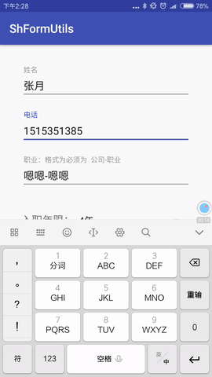

# ShFormUtils
android表单映射框架
#Download

Download the latest JAR or grab via Maven:
~~~xml
<dependency>
  <groupId>com.sh.shformutils</groupId>
  <artifactId>shform</artifactId>
  <version>1.0.0</version>
   <type>pom</type>
</dependency>
~~~
or Gradle:
~~~gradle
compile 'com.sh.shformutils:shform:1.0.0'
~~~
#功能
* ## 表单对象映射

* ## 表单参数检查
